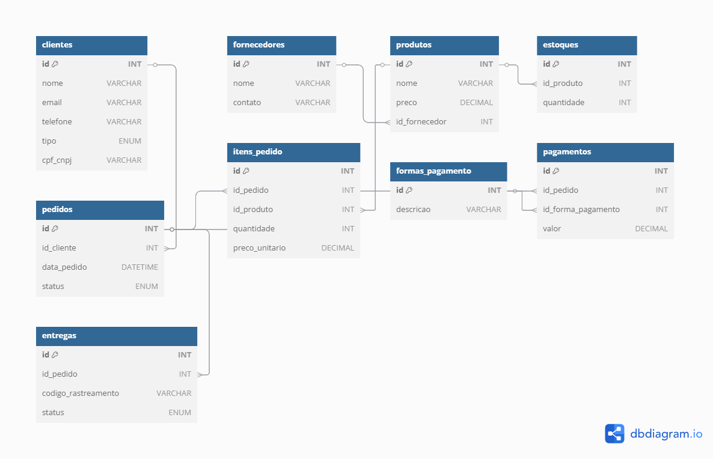

# 📌 E-commerce Database Model

  
(*diagrama EER*)

## 📖 Descrição
Este projeto apresenta a modelagem lógica de um banco de dados para um sistema de e-commerce, contemplando clientes, fornecedores, produtos, pedidos, pagamentos e entregas. A estrutura segue boas práticas de normalização e relacionamentos definidos.

## 📂 Estrutura do Banco de Dados
O banco de dados é composto pelas seguintes tabelas:

- **clientes**: Contém informações de clientes pessoa física e jurídica.
- **fornecedores**: Armazena dados dos fornecedores de produtos.
- **produtos**: Contém os itens comercializados na plataforma.
- **estoques**: Gerencia a quantidade de produtos disponíveis.
- **pedidos**: Registra compras feitas pelos clientes.
- **itens_pedido**: Detalha os produtos dentro de cada pedido.
- **formas_pagamento**: Contém os métodos de pagamento disponíveis.
- **pagamentos**: Registra os pagamentos efetuados.
- **entregas**: Gerencia status e rastreamento de envios.

## 📜 Script SQL
O banco de dados pode ser criado utilizando o script presente no arquivo [`ecommerce_sql.sql`](./ecommerce_sql.sql).

## 🔍 Consultas SQL
O projeto inclui consultas para análise, como:

- Quantidade de pedidos por cliente.
- Identificação de fornecedores que também são vendedores.
- Relação de produtos, fornecedores e estoques.
- Listagem de nomes de fornecedores e seus produtos.

## 🚀 Como Utilizar
1. Execute o script SQL para criar o banco de dados.
2. Popule as tabelas com os dados iniciais.
3. Utilize as queries para explorar os dados.

## 📷 Diagrama EER
 

## 🛠 Tecnologias Utilizadas
- **MySQL** para a modelagem e execução do banco de dados.
- **MySQL Workbench / dbdiagram.io** para geração do diagrama EER.
- **GitHub** para versionamento do projeto.

## 📌 Autor
Projeto desenvolvido para fins acadêmicos e aprendizado de modelagem de banco de dados.
